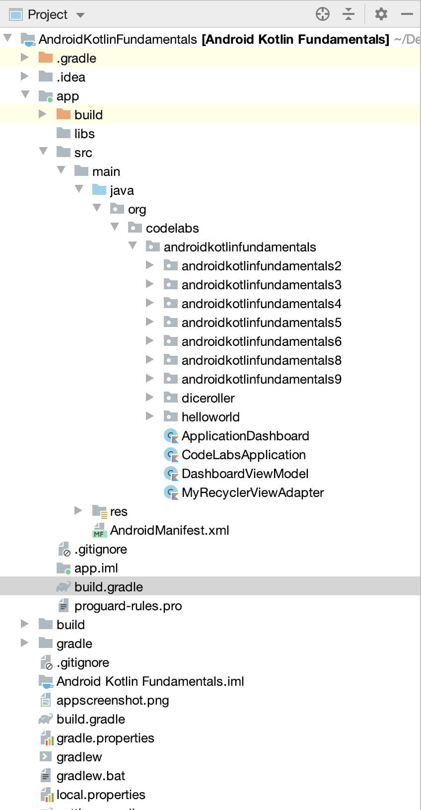

# 30 Days Of Kotlin 

## Android-Kotlin-Fundamentals
This repository contains Android Studio project with Sample Codes integrated from Android Kotlin Fundamentals CodeLabs. This Repo contains all the examples from Android Kotlin Fundamentals CodeLabs. Everyone can fork and use this repo to see outputs of the basic fundamentals defined in the Android Kotlin Fundamentals For Programmers in CodeLabs.

You can view the full details of this program here -: [Android Kotlin Fundamentals](https://developer.android.com/courses/kotlin-android-fundamentals/overview?utm_source=week1&utm_medium=email&utm_campaign=30DaysOfKotlin&utm_term=Intermediate)

## Highlight For Repository
This Repository contains a ApplicationDashboard Activity contains list of all the examples in Android-Kotlin-Fundamentals CodeLab which you can view just by clicking on them. 

## Navigator Activity ScreenShot

## Project Structure

## Examples Covered
1. **Build your first app** 
2. **Layouts** 
3. **Navigation** 
4. **Activity and fragment lifecycles** 
5. **Architecture components**
6. **Room database and coroutines**  
7. **RecyclerView**
8. **Connecting to the internet**
9. **Repository**

## Android Components Used
1. **Data Binding**
2. **LiveData**
3. **Navigation**
4. **ViewModel**
5. **ViewModelFactory**
6. **RecyclerView**
7. **Room**

## 3rd Party Integration's
1. **Glide**
2. **Retrofit**
3. **Moshi**
4. **Timber**

## Testing Examples
In order to test different **Android Kotlin Fundamental Examples** in this sample **Android Studio** project follow below steps:
1. Run the App
2. Main Dashboard screen will be launched which will contain list of All the examples in CodeLab
3. Click on Any of the list item to view the Output of the CodeLab Example Output

## Language Used => Kotlin
Kotlin is a **cross-platform**, **statically typed**, **general-purpose** programming language with type inference. Kotlin is designed to interoperate fully with Java, and the JVM version of its standard library depends on the Java Class Library, but type inference allows its syntax to be more concise.

Android mobile development has been **Kotlin-first** since **Google I/O in 2019**.

For More information about **Kotlin** and It's benefit with **Android Development** can be found [Here](https://kotlinlang.org/docs/reference/android-overview.html)

In this project **Kotlin Plugin** Version is:**1.3.0+**

## Android Studio
Android Studio is the official integrated development environment for Google's Android operating system, built on JetBrains' IntelliJ IDEA software and designed specifically for Android development. It is available for download on Windows, macOS and Linux based operating systems. 

In this project **Android Studio** Version is: ***3.6.2**

## Gradle
Gradle is an open-source build automation system that builds upon the concepts of Apache Ant and Apache Maven and introduces a Groovy-based domain-specific language instead of the XML form used by Maven for declaring the project configuration

In this project **Gradle Plugin** Version is: **3.6.2**

